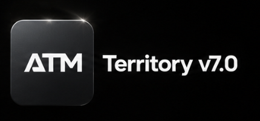

# ATM Territory Maker — Version 7

### Territory planning. Refined.

Una nuova esperienza per creare, organizzare e trasferire territori.

---

## Version 7

ATM Territory Maker Version 7 offre un ambiente chiaro e focalizzato per costruire, verificare e preparare territori. **ATM Bridge** completa il flusso accompagnando il file GeoJSON verso Territory Helper.

> Questo è il repository pubblico ufficiale di presentazione. Il codice sorgente dell'applicazione e dell'estensione non è incluso.

## Collegamenti ufficiali

- **Vetrina Version 7:** https://stefano-dotcom.github.io/ATM-Territory-Maker/
- **ATM Territory Maker:** https://atm-v7.netlify.app/
- **ATM Bridge:** https://atm-v7.netlify.app/website/
- **Supporto:** atmsupportcentre@gmail.com

## Diritti

Copyright © 2026 ATM Territory Maker. Tutti i diritti riservati. Consulta [LICENSE.md](LICENSE.md).
